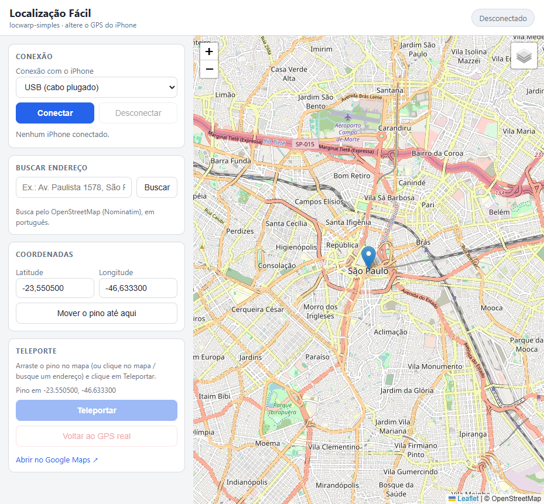

# locwarp-simples — "Localização Fácil"

Fork **simplificado e em português** do [LocWarp](https://github.com/keezxc1223/locwarp):
só o essencial para mudar a localização (GPS) do iPhone.

- **Sem cabo (USB)** ou **sem cabo mesmo (Wi-Fi)**
- **Pin arrastável** no mapa + clique no mapa
- **Coordenadas** digitadas (lat/lng)
- **Busca de endereço** (OpenStreetMap/Nominatim, em pt-BR)
- Mapas: OpenStreetMap, Google Ruas, Google Satélite e ESRI Satélite
- Botões **Teleportar** e **Voltar ao GPS real**
- iPhone iOS **17+**, sem jailbreak



## Requisitos

| Item | Detalhe |
| --- | --- |
| PC | Windows 10/11 (também funciona em Linux; no Android/Termux é o próximo passo) |
| Python | 3.10 ou mais novo |
| Drivers | iTunes **ou** Apple Devices instalado (driver USB da Apple) |
| iPhone | iOS 17+ com **Modo Desenvolvedor** ligado (Ajustes → Privacidade e Segurança) |
| Wi-Fi | iPhone e PC na **mesma rede**, com pareamento Wi-Fi feito uma vez |

## Como usar

1. Dê dois cliques em **`iniciar.bat`** (na primeira vez ele cria o ambiente e instala as dependências).
2. O navegador abre em `http://127.0.0.1:8777`.
3. Escolha **USB** ou **Wi-Fi** e clique em **Conectar**.
   - USB: plugue o cabo, desbloqueie o iPhone e confie no computador.
   - Wi-Fi: requer o pareamento abaixo.
4. Arraste o pino (ou clique no mapa, ou busque um endereço) e clique em **Teleportar**.
5. **Voltar ao GPS real** encerra a simulação.

### Pareamento Wi-Fi (uma vez)

Com o cabo plugado, rode **`parear_wifi.bat`** (ou o comando abaixo):

```bash
python -m pymobiledevice3 lockdown wifi-connections on
```

No iPhone, confirme em Ajustes → Geral → Ajustes de rede/“Conectar via rede” quando disponível.
Depois disso o botão **Conectar** com o modo **Wi-Fi** funciona sem cabo.

## Linha de comando (sem interface)

```bash
python testar_conexao.py                       # USB → São Paulo → volta ao real
python testar_conexao.py --modo wifi
python testar_conexao.py --lat 48.8584 --lng 2.2945 --manter
```

## Como funciona

```
navegador  →  servidor.py (FastAPI, porta 8777)
                  │
                  ├─ USB:  usbmuxd (iTunes/Apple Devices)
                  └─ Wi-Fi: pareamento já existente + bonjour
                  │
                  └─ PreferredRsdTunnel (túnel userspace, SEM administrador)
                        └─ DvtProvider → LocationSimulation.set(lat, lng)
```

- Toda a parte de dispositivo usa a [pymobiledevice3](https://github.com/doronz88/pymobiledevice3) **11+**;
  no Windows ela cria um túnel em Python puro (sem TUN, sem UAC).
- Um iPhone por vez. Reconexão automática única quando o canal cai (tela bloqueada, cabo, etc.).

## Limitações

- iOS 16 e anterior: não suportado.
- Wi-Fi pode cair quando o iPhone bloqueia a tela; clique em Conectar de novo (o LocWarp original
  tinha um keepalive experimental que ficou de fora da versão simples).
- Não controla mais de um iPhone ao mesmo tempo.
- O servidor escuta só em `127.0.0.1`; para controlar de outro aparelho troque `API_HOST`
  para `"0.0.0.0"` no `servidor.py` (só faça isso em rede confiável).

## Créditos e licença

MIT — veja [LICENSE](LICENSE) e [NOTICE.md](NOTICE.md).
Baseado no LocWarp (© keezxc1223, MIT) e na pymobiledevice3 (© doronz88, GPL-3.0 — usada como dependência).
